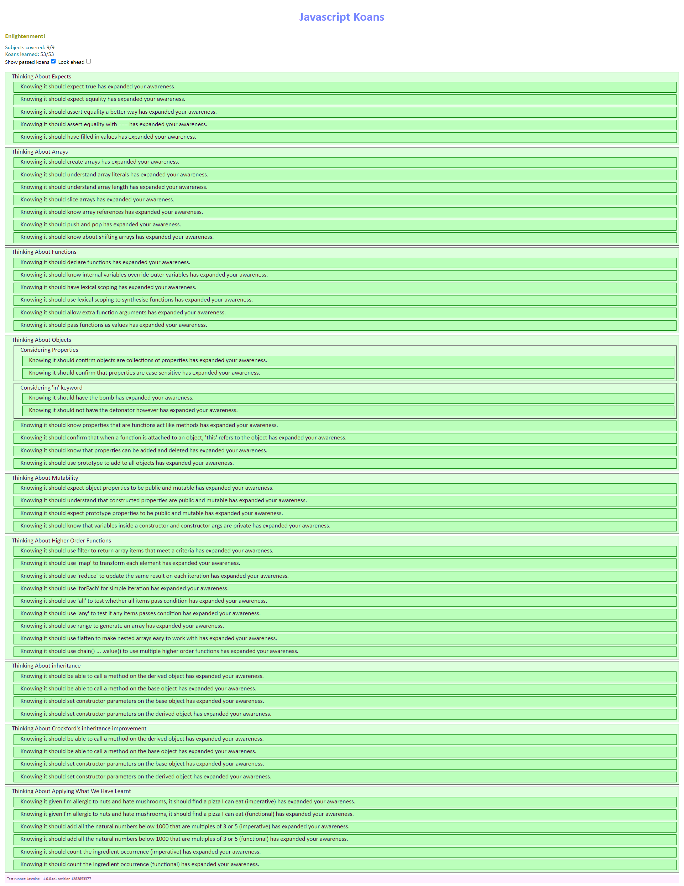

## JavaScript Study Log
 
 
## Folder Structure
- [algorithm](./algorithm)

   [1) 서울에서 김서방 찾기](./algorithm/programmers/서울에서김서방찾기.js) 

   [2) 가운데 글자 가져오기](./algorithm/programmers/가운데글자가져오기.js)  

   [3) 수박수박수박수박수박수](./algorithm/programmers/수박수박수박수박수박수.js)
 
   [4) 이진 탐색](./algorithm/binary_search.js)

   [5) 퀵 정렬](./algorithm/quicksort.js)  

   [6) 재귀](./algorithm/recursion.js)

   [7) 선택 정렬](./algorithm/selection_sort.js)

 

- [Mini Web Projects](./mini_web_projects)

   [1) Simple web digital clock](./mini_web_projects/simpleClock) 

   [2) Background Changer](./mini_web_projects/BackgroundChanger) 

   [3) Carousel](./mini_web_projects/Carousel)

   [4) Calendar](./mini_web_projects/Calendar_Boilerplate) 

   [5) Number Baseball](./mini_web_projects/Baseball_Boilerplate)

 

- [JavaScript Koans](./javascript-koans-master)

   [1) About Expects](./javascript-koans-master/koans/AboutExpects.js)

   [2) About Arrays](./javascript-koans-master/koans/AboutArrays.js)

   [3) About Functions](./javascript-koans-master/koans/AboutFunctions.js)

   [4) About Objects](./javascript-koans-master/koans/AboutObjects.js)

   [5) About Mutability](./javascript-koans-master/koans/AboutMutability.js)

   [6) About Higher Order Functions](./javascript-koans-master/koans/AboutHigherOrderFunctions.js)

   [7) About inheritance](./javascript-koans-master/koans/AboutInheritance.js)

   [8) About Applying What We Have Learnt](./javascript-koans-master/koans/AboutApplyingWhatWeHaveLearnt.js)

   
   